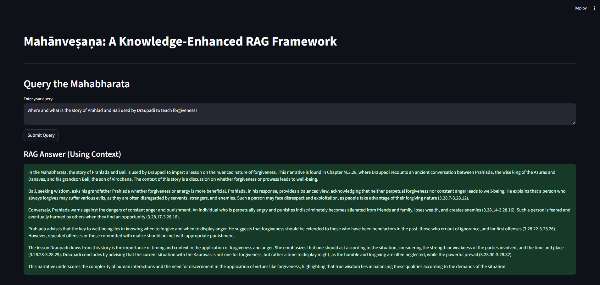
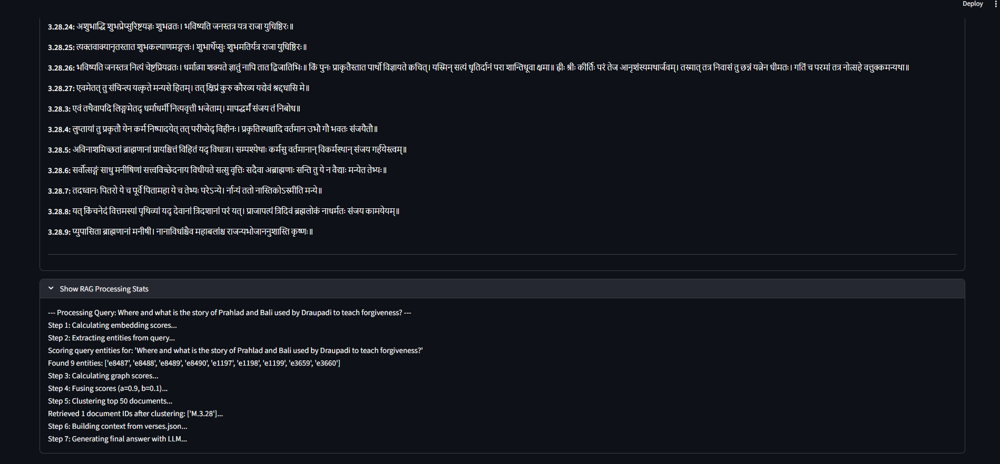

# Mahānveṣaṇa

### A Knowledge-Enhanced RAG Framework for the Mahabharata


##  Features

  * **Knowledge-Enhanced RAG:** Implements a multi-stage pipeline that includes embedding search, entity extraction, graph scoring, and score fusion for highly accurate context retrieval.
  * **Raw Sanskrit Verse Retrieval:** Includes a "Show Retrieved Raw Context" feature that displays the *exact* Sanskrit verses (from `full_text.json`) used to generate the answer.


## Screenshots

### Main Query Interface


### Retrieved Sanskrit Context


### Processing Stats


-----

##  Setup and Installation

### 1\. Clone the Repository

```bash
git clone <your-repo-url>
cd <your-repo-name>
```

### 2\. Install Dependencies

All Python dependencies are listed in `requirements.txt`. It's recommended to use a virtual environment.

```bash
# Navigate into the application folder
cd RAG

# Create and activate a virtual environment (optional but recommended)
python -m venv venv
source venv/bin/activate  # On Windows: venv\Scripts\activate

# Install requirements
pip install -r ../requirements.txt 
```

*(Note: Assuming `requirements.txt` is in the root, alongside the `RAG` folder)*

-----

##  Required Data and Models (Crucial Step)

This repository **does not** include the large data and embedding model files required to run the application. You must manually create these two directories inside the `RAG` folder and populate them.

### 1\. `RAG/dataset/`

Create this folder and add the following JSON files:

  * `chapter_entity_ids.json`
  * `chapters.json`
  * `entities_kb.json`
  * `entity_index.json`
  * `full_text.json`
  * `verses.json`

### 2\. `RAG/embedding_models/`

Create this folder and add your pre-computed embedding models and indexes:

  * `corpus.index` (e.g., your FAISS index)
  * `doc_ids.pkl`
  * `embeddings_multi_mp.npy`
  * *(...and any other required embedding files)*

-----

##  Configuration

The application requires an OpenAI API key.

1.  Inside the `RAG` directory, create a file named `.env`

2.  Add your API key to this file:

    ```
    OPENAI_API_KEY="sk-BLAH BLAH BLAH"
    ```

##  How to Run

Once you have installed the dependencies, created the `dataset` and `embedding_models` folders, and configured your `.env` file:

1.  Make sure you are in the `RAG` directory:

    ```bash
    cd RAG
    ```

2.  Run the Streamlit application:

    ```bash
    streamlit run main.py
    ```


